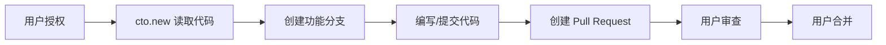
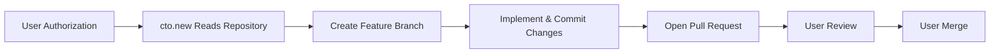

# cto.new GitHub 权限指南 | GitHub Permissions Guide

> 🌐 本文档介绍 cto.new 在 GitHub 上的权限范围、使用流程与安全实践，并提供中英文双语说明。This guide explains how cto.new interacts with GitHub, which permissions are required, and how security is enforced.

---

## 🇨🇳 cto.new 在 GitHub 上的权限说明

| 权限类别 | 描述 |
| --- | --- |
| 👁️ 读取权限 | 浏览代码、目录结构、提交历史和分支信息 |
| ✏️ 写入权限 | 在独立分支上提交代码，不影响主分支 |
| 🔄 协作权限 | 创建 Pull Request 并在相关 Issue 中互动 |

### ✅ cto.new 可以做什么

- **读取仓库内容**
  - 📄 读取代码文件和目录结构
  - 🕓 查看提交历史与分支信息，理解项目上下文
- **创建和管理分支**
  - 🌱 基于主分支创建新的功能分支
  - 🛠️ 在独立分支上实施更改，不直接影响主分支
- **提交代码**
  - ➕ 添加新文件，✏️ 修改现有文件，🗑️ 删除不再需要的文件
  - 📝 自动生成符合规范的提交信息
- **创建 Pull Request**
  - 📨 自动创建 PR 并填写描述、变更列表
  - 🔗 在 PR 中关联相关任务或 Issue 信息
- **读取和响应 Issues**（集成 GitHub Issues 时）
  - 👀 读取 Issue 内容和讨论
  - 💬 在 Issue 中发表评论或更新进度

### ❌ cto.new 不能做什么

- 🛡️ **不能直接修改主分支**
  - 所有改动都通过分支 + PR 流程
  - 必须由人工审查和合并，保障主分支安全
- 🏗️ **不能创建新仓库**
  - 新仓库需由用户手动创建并授权
- 🗑️ **不能删除仓库或代码历史**
  - 不具备删除权限，保护您的代码资产
- ⚙️ **不能修改仓库设置**
  - 不能更改可见性、分支保护规则或协作者名单
- 🚫 **不能执行强制推送（force push）**
  - 不会覆盖历史记录，确保版本控制完整性
- 🔒 **不能合并 Pull Request**
  - 最终合并操作由用户手动执行，维持代码质量把控

---

## 🔐 权限的安全设计（中文）

- **OAuth 授权机制**：使用 GitHub 官方 OAuth 流程，用户可随时在 GitHub 设置中撤销授权。
- **最小权限原则**：仅请求完成任务所需的读写权限，不申请仓库管理等高危权限。
- **操作可追溯**：所有分支、提交、PR 和 Issue 操作都会在 Git 历史中留下记录，便于审计。
- **用户最终控制权**：用户决定授权范围、可随时暂停集成，并负责最终的 PR 审查与合并。

---

## 📈 工作流程图（中文）

---

## ❓ 常见问题（中文）

**Q: 为什么需要这些权限？**  
A: 为了自动执行分支创建、代码提交和 PR 创建等开发流程，cto.new 需要基础的读写权限。

**Q: 权限是否安全？**  
A: 授权通过 GitHub 官方 OAuth，使用最小权限策略，并且所有操作均可追踪。

**Q: 如何撤销授权？**  
A: 前往 GitHub → Settings → Applications → Authorized OAuth Apps，找到 cto.new 并点击 "Revoke"。

**Q: 如何查看 cto.new 的操作记录？**  
A: 可在仓库的 Pull Request、Commit 记录和 Issue 评论中查看，所有操作都有明确的作者标识。

---

## ✅ 最佳实践（中文）

- 🔐 启用分支保护，要求 PR 审查或状态检查通过后再合并。
- 👀 定期审查 PR，确保变更符合团队标准。
- 📝 使用有意义的提交消息，便于跟踪历史。
- 🌳 保持主分支稳定，仅在通过审查后合并变更。
- 🧭 定期检查授权应用列表，确保权限符合团队策略。

---

## 🇺🇸 cto.new GitHub Permissions Overview

| Permission Type | Description |
| --- | --- |
| 👁️ Read Access | Inspect repository content, structure, history, and branches |
| ✏️ Write Access | Commit changes on feature branches without touching the default branch |
| 🔄 Collaboration | Open Pull Requests and interact with related Issues |

### ✅ What cto.new Can Do

- **Read Repository Content**
  - 📄 Access source files and folder hierarchy
  - 🕓 Review commit history and branch metadata for context
- **Create and Manage Branches**
  - 🌱 Spin up feature branches from the protected default branch
  - 🛠️ Work in isolation so the main branch remains untouched
- **Commit Code**
  - ➕ Add files, ✏️ update code, 🗑️ remove obsolete assets
  - 📝 Auto-generate conventional, human-readable commit messages
- **Open Pull Requests**
  - 📨 Draft PRs with summaries, change logs, and linked tasks
  - 🔗 Associate related Issues or ticket references
- **Read and Respond to Issues** (when GitHub Issues are integrated)
  - 👀 View Issue descriptions and history
  - 💬 Comment or post status updates directly on the Issue

### ❌ What cto.new Cannot Do

- 🛡️ **Cannot Modify the Default Branch Directly**
  - Every change flows through the branch + PR review pipeline managed by humans
- 🏗️ **Cannot Create New Repositories**
  - Users provision repositories and grant access afterward
- 🗑️ **Cannot Delete Repositories or History**
  - No destructive permissions are granted
- ⚙️ **Cannot Change Repository Settings**
  - Visibility, branch protection, and collaborators stay under owner control
- 🚫 **Cannot Force-Push**
  - Repository history remains intact and auditable
- 🔒 **Cannot Merge Pull Requests**
  - Final merge decisions remain in the hands of repository maintainers

---

## 🔐 Security & Permission Design (English)

- **OAuth Authorization**: Uses GitHub's secure OAuth flow; access can be revoked anytime via GitHub settings.
- **Principle of Least Privilege**: Requests only the scopes required for task execution—no admin-level permissions.
- **Full Auditability**: Every branch, commit, PR, and Issue comment is recorded with author attribution.
- **User-in-the-Loop Control**: Humans approve scopes, review PRs, and perform merges, guaranteeing oversight.

---

## 📈 Workflow Visualization (English)

> ℹ️ The bilingual diagrams illustrate the same end-to-end flow to reinforce how permissions are used safely.

---

## ❓ Frequently Asked Questions (English)

**Q: Why are these permissions needed?**  
A: Branch creation, code commits, and PR generation require read/write scopes so cto.new can execute the full development workflow.

**Q: Are the permissions safe?**  
A: Yes. Authorization follows GitHub OAuth best practices, adheres to least privilege, and all actions are transparent in Git history.

**Q: How do I revoke access?**  
A: Navigate to GitHub → Settings → Applications → Authorized OAuth Apps, locate cto.new, and click “Revoke”.

**Q: How can I review what cto.new has done?**  
A: Inspect the repository's Pull Requests, commit history, and Issue discussions—each action is clearly attributed to the cto.new integration.

---

## ✅ Recommended Best Practices (English)

- 🔐 Enable branch protection and require PR reviews or status checks before merging.
- 👀 Schedule regular PR reviews to maintain consistent quality standards.
- 📝 Encourage descriptive commit messages to simplify traceability.
- 🌳 Keep the default branch stable by merging only reviewed, tested changes.
- 🧭 Periodically audit authorized OAuth applications to ensure compliance with team policies.
